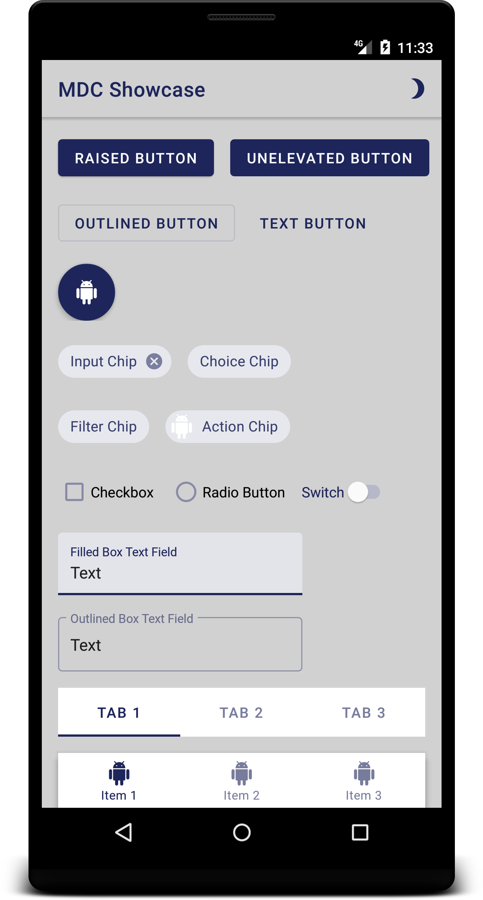

material design components showcase
===================================

[Nick Rout](https://twitter.com/ricknout) added [this awesome debug activity to MuVi](https://github.com/ataulm/muvi/pull/27) which showcases Material components with a given theme. This library follows the same idea, but saves you from having to do the same in every app that you have!

Light preview | Dark preview
---|---
 | 

Add it as a dependency to your project:

```groovy
allprojects {
    repositories {
        maven { url "https://jitpack.io" }
    }
}

implementation 'com.github.ataulm:material-design-components-showcase:<latest-release-or-commit>'
```

Then open the included Activity:

```kotlin
class DebugActivity : AppCompatActivity() {

    override fun onCreate(savedInstanceState: Bundle?) {
        super.onCreate(savedInstanceState)
        setContentView(R.layout.activity_debug)

        openThemeShowcaseButton.setOnClickListener {
            startMdcShowcase()
        }
    }
}
```

We can specify a particular theme to load too (by default it'll take the application theme):

```kotlin
startMdcShowcase(R.style.Theme_Demo)
```

There's a MaterialToolbar too, which we can set with a flag:

```kotlin
startMdcShowcase(R.style.Theme_Demo, shouldSetSupportActionBar = true)
```

If you want to customise the layout, you can pass an `ArrayList` of layout resources, each of which will be inflated as a separate row.

```kotlin
startMdcShowcase(R.style.Theme_Demo, inflatables = arrayListOf(R.layout.demo_custom_inflatable))
```

If you want to _augment_ the default set, you can include the original one too:

```kotlin
startMdcShowcase(
    R.style.Theme_Demo,
    shouldSetSupportActionBar = true,
    inflatables = arrayListOf(R.layout.mdcs__default_inflatable, R.layout.demo_custom_inflatable)
)
```
